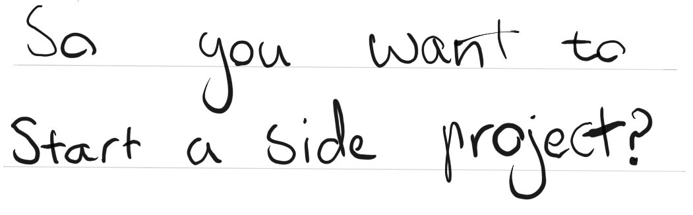
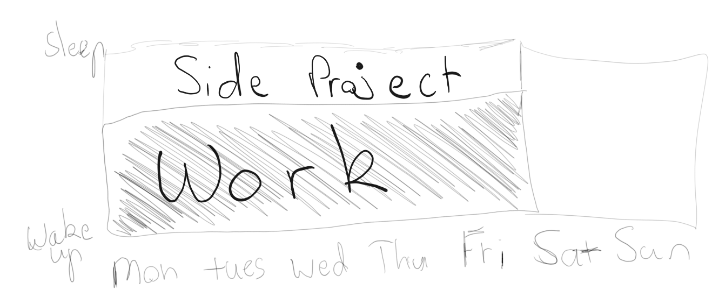

# So you want to start a side project huh?

When I first started my career as a Software Developer I was told working on projects outside of work is a must. I took this advice seriously and have started several side projects over the last few years. I've learnt lots working on my side projects but it's not a requirement for being a successful software developer, lots of people I've met in the industry rarely code outside of work and are excellent programmers. I've had a lot of fun working on my side projects, when they didn't become fun I often stopped and lost interest.

## Why are you doing this side project?

Before starting a side project it's worth making a quick plan about what you want to achieve with your project. This will help you set your expectations and help you understand the scope. Think about how much time you are going to dedicate to the project. You can complete a side project in a day or work on it for 10 years.

Some goals I've had for side projects in the past are:

- Make a product to sell and replace my full time job
- Create a nice portfolio piece to show off my work
- Create a product to help a friend with their PHD (Radiant Tulip link)
- Learn a new technology to up skill myself

## Making a plan to work on it

It's a good idea to make a small plan for when you're going to be working on your side project, find a time that your often watching TV or doing something unproductive. Don't feel like you have to stick to your plan after all a side project is suppose to be fun don't force it. One of the best things about working on a side project is it's completely optional, if you're not feeling it don't worry about it and pick it up later when you feel like it.

## Deciding if you want to work with other people on your project

### A solo project
Most of the side projects I've worked on I have worked on by myself and I have really enjoyed it. If your full time work is programming you're most likely working in a team where you work to the team's standards are ideals. This is the right thing to do at work, however, on your side project you can do whatever you like if you're on your own. I have really enjoyed this part of working on side projects by myself. You can just make things without having to talk to people, understand requirements and deal with pesky code reviews.

### A team project

[//]: <> (TODO Team side project links)
Depending on the goal of your side project you might want to form a team and work together. I've done this on a few side projects, it's always harder than working on your own but ultimately all the side projects I've worked on the most I worked with other people. I find it easier to keep each other motivated, when I'm feeling down someone else will be feeling motivated and they can really help pick you up. When you're working on your side project you can take weeks off, with a team you need to at least communicate when you're planning to take time off and you'll be accountable for it.

You need to collaborate, schedule meetings and define a process for how your going to work. Again this process doesn't have to be similar to the process you use at work in your bigger team. Make something that is practical for you all. Before starting your project as a team it's good to have a meeting, workout everyone's expectations for the project and how much time you're all going to put into it. This can help prevent problems down the line.

## Side project ideas

Often I've found myself in a position where I want to work on something I just don't have any ideas to work on.

Here's a few common ideas that might inspire you

[//]: <> (TODO INCLUDE never ending project link)

- Create a never ending project
- Make a small video game
- Follow a tutorial and expand it into something more interesting once you're done
- Automate something in your home
- Write a blog
- Build something that relates to a hobby of yours
- Integrate two technologies you've worked with before
- Create a small Proof of Concept for something you're interested in at work

## What to do when you're done
Now is the time to reflect on your initial goal. Have you achieved what you set out to do? If you're goal was to learn a new skill it's time to tell your employer what you've done, add it to your resumé, and create a post on LinkedIn with your Github link. If you wanted to make something to sell it's time to sell it.

Make sure you let people know about your side project to make sure you get the maximum credit

